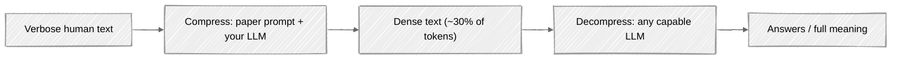

# tokentoken

[](LICENSE)
[](https://www.python.org/downloads/)

**Compile human prompts into dense LLM machine language — save up to 70% on token costs.**

`tokentoken` is a Python SDK and CLI that compresses verbose text into a minimal, LLM-native representation that any capable model can interpret without a codebook — and recovers it on demand.

> Based on the research paper [*Large Language Models Do Not Always Need Readable Language*](https://arxiv.org/abs/2606.19857) (arXiv:2606.19857).

## Features

- **14 compression modes** — every prompt variant from the paper (`default` + `bt_p1`–`bt_p13`)
- **4 providers** — OpenAI, Google Gemini, Anthropic, and local Ollama
- **Cross-model readable** — text compressed by one LLM can be read by another
- **Built-in analytics** — token savings, retention ratio, readability and efficiency metrics
- **Agentic workflows** — agent memory compression, multi-agent messaging, context-window extension
- **Clean CLI** — inline text or file input, one-line errors, meaningful exit codes

## Installation

### PyPi
```bash
pip install tokentoken
```

### From Source
Requires Python 3.9+.

```bash
git clone https://github.com/thesumitbanik/tokentoken.git
cd tokentoken
pip install .
```

For development:

```bash
pip install -e ".[dev]"
```

## Configuration

API keys are read from environment variables — never hardcode them:

```bash
export GEMINI_API_KEY="..."      # default provider
export OPENAI_API_KEY="..."
export ANTHROPIC_API_KEY="..."
# Ollama needs no key (local, http://localhost:11434)
```

| Provider | `--provider` | Environment variable | Example `--model` |
|---|---|---|---|
| Google Gemini | `gemini` *(default)* | `GEMINI_API_KEY` | `gemini-3.5-flash` *(default)* |
| OpenAI | `openai` | `OPENAI_API_KEY` | `gpt-4` |
| Anthropic | `anthropic` | `ANTHROPIC_API_KEY` | `claude-3-5-sonnet` |
| Ollama | `ollama` | — | `llama3` |

### OpenAI-compatible endpoints

Point the `openai` provider at any OpenAI-compatible server — vLLM, LM Studio, LocalAI, OpenRouter, or Ollama's `/v1` API:

```bash
export OPENAI_API_KEY="not-needed"   # placeholder for keyless local servers
tokentoken compress --text "..." --provider openai --model my-model \
  --base-url http://localhost:1234/v1
```

```python
tt = TokenToken(provider="openai", model="my-model", base_url="http://localhost:1234/v1")
```

No flag needed if you prefer environment configuration: the OpenAI client reads `OPENAI_BASE_URL` automatically.

## Quick Start

### Python SDK

```python
from tokentoken import TokenToken, CompressionMode

# Uses GEMINI_API_KEY from the environment (or pass api_key="...")
tt = TokenToken(provider="gemini", model="gemini-3.5-flash")

result = tt.compress("Your verbose text here...", mode=CompressionMode.DEFAULT)

print(f"Original:   {result.original_tokens} tokens")
print(f"Compressed: {result.compressed_tokens} tokens")
print(f"Reduction:  {result.savings_pct}%")

# Any capable LLM can interpret it — no codebook required
answer = tt.decompress(result.dense_text, question="What is the main topic?")
```

### CLI

```bash
# Compress a file
tokentoken compress input.txt --out dense.txt

# Or inline text — no file needed
tokentoken compress --text "Your verbose text here..."

# Read it back
tokentoken decompress dense.txt --question "What is the main topic?"

# Explore
tokentoken --help
tokentoken list-modes
```

## CLI Reference

Run any command with `--help` for full options.

| Command | Description |
|---|---|
| `compress` | Compress a file or inline `--text`; writes `--out` (default `dense.txt`) |
| `decompress` | Interpret compressed text; optional `--question` to answer from it |
| `analyze` | Measure compression potential; add `--compressed` to compare against an output |
| `list-modes` | List all 14 compression modes with paper references |
| `estimate` | Count tokens in a file |
| `agent-memory` | Compress agent conversation histories from a directory |
| `multi-agent` | Compress an inter-agent message between `--sender` and `--receiver` |
| `cross-model` | Verify compressed text remains readable by a different model |
| `extend-context` | Compress a long document down to a `--target-tokens` budget |

**Common options:** `--provider` (default `gemini`), `--model` (default `gemini-3.5-flash`), `--out/-o`, `--mode` (for `compress`), and `--base-url` (OpenAI-compatible endpoints).

Failures print a single-line error and exit with code `1` — never a traceback.

## Python API

### `TokenToken(provider, model, api_key=None, host=None, base_url=None)`

| Method | Returns | Description |
|---|---|---|
| `compress(text, mode=CompressionMode.DEFAULT)` | `CompressionResult` | Compress text into dense form |
| `decompress(text, question=None)` | `str` | Interpret compressed text / answer a question |
| `compress_for_agent_memory(memories, session_id=None)` | `AgentMemoryResult` | Compress conversation histories |
| `compress_for_multi_agent(message, sender, receiver)` | `MultiAgentMessage` | Compress inter-agent messages |
| `check_cross_model_compatibility(text, reader_provider, reader_model)` | `CrossModelCompatibility` | Test readability across models |
| `extend_context_window(long_text, target_tokens=200000)` | `str` | Compress long documents to a token budget |
| `get_compression_analytics(original, compressed)` | `dict` | Detailed compression metrics |

Utility functions are exported at package level: `count_tokens`, `check_breakeven_threshold`, `chunk_text`, `calculate_compression_metrics`, `estimate_readability`, `calculate_token_efficiency`, `validate_compression_result`.

### `CompressionResult`

| Field | Type | Description |
|---|---|---|
| `dense_text` | `str` | The compressed output |
| `original_tokens` | `int` | Input token count |
| `compressed_tokens` | `int` | Output token count |
| `savings_pct` | `float` | Token reduction in percent |
| `retention_ratio` | `float` | Output size ÷ input size |
| `readability_metrics` | `dict` | Dale-Chall estimate, difficult-word ratio, word count |
| `efficiency_metrics` | `dict` | Tokens per word, chars per token, compression potential |
| `validation` | `dict` | Quality checks + chain-of-thought tax warning |

### Compression Modes

Select with `--mode bt_p7` (CLI) or `mode=CompressionMode.BT_P7` (SDK).

| Mode | Paper ref | Description |
|---|---|---|
| `default` | C.1 | Default compression prompt |
| `bt_p1` | C.2.1 | Adaptive Symbolic Collapse |
| `bt_p2` | C.2.2 | Refined Zero-Overhead Compression |
| `bt_p3` | C.2.3 | Minimal Lossless Objective |
| `bt_p4` | C.2.4 | Structured Omnilingual Mapping |
| `bt_p5` | C.2.5 | Canonical Omnilingual-Symbolic |
| `bt_p6` | C.2.6 | Structured Mapping Control |
| `bt_p7` | C.2.7 | Canonical Compression Objective |
| `bt_p8` | C.2.8 | Fixed Symbolic Mapping Rules |
| `bt_p9` | C.2.9 | Structured Semantic Mapping |
| `bt_p10` | C.2.10 | LLM-Native Compressor |
| `bt_p11` | C.2.11 | Compact Symbolic Mapping |
| `bt_p12` | C.2.12 | Free-Emergence Attention Checklist |
| `bt_p13` | C.2.13 | ASCII Anchor Skeleton |

## How It Works



Compression swaps verbose natural language for high-density multilingual and symbolic forms. No decoder, codebook, or fine-tuning is involved — interpretation is a capability the reading LLM already has.

## Use Cases

- **Document QA** - compress long documents while preserving semantic fidelity for question answering
- **Agent memory** - compress conversation histories to reduce storage while maintaining reliable recall
- **Multi-agent communication** - cut context overhead between collaborating agents
- **Context window extension** - handle documents that exceed model limits by compressing chunks

## Contributing

```bash
git clone https://github.com/sumitbanik/tokentoken.git
cd tokentoken
pip install -e ".[dev]"
pytest
```

Issues and pull requests are welcome.

## License

MIT — see [LICENSE](LICENSE).
